# Data Science Capstone Project - Predicting Designer Handbag Resale Value  

This project was completed as part of the Data Science Immersive course at General Assembly in May 2021.

## Goals

The first goal is to accurately predict the resale value of designer handbags with Linear Regression model and reveal which coefficients have higher impact on predicting the secondary market price.

The second goal is to build a classification model to determine whether a luxury handbag is a good investment or not, based on a derivable variable, Return on Investment (ROI). Next aim is to view the predictive power of each feature and which features generate the best returns.

**Overall Approach**

1. [Acquire data](#Acquire-Data) - data will be scraped and parsed using Requests and Beautiful Soup
2. [Data Cleaning](#Data-Cleaning) - identify missing or inconsistent data.  Store in a clean format ready for processing
3. [EDA](#EDA) - explore the data to identify trends and correlations
4. [Modelling](#Modelling) - train a range of regression models, score, cross-validate and test on unseen data
5. [Evaluation](#Evaluation) - Evaluate and assess limitations of best model in practice against stated aim
6. [Conclusions](#Conclusions)

## Acquire Data

I used the Python libraries Requests and Beautiful Soup to scrape and parse results data published online. Initially I had hoped to collect data using an API, but unfortunately, there weren’t any relevant API or ready collected datasets to implement my capstone project idea. After doing research on where to get the data, there were not many webpages that had a sufficient amount of data information or sites that were not blocking you from Web Scraping. I have decided to choose the Vestiaire Collective website, as well as extracting the current Mean Retail Price from original webpages or public magazines. 

I have decided to go only with 3 top brands in the fashion industry and focused my attention on the iconic handbags in each brand category.

Data acquired:
* 3 Top brands in fashion industry
* 14 features (-> 16 features at preparation for modelling stage)
* 12,916 unique handbag observations (uncleaned)
* limited edition feature only in Louis Vuitton brand to test one of my hypothesis regarding investment return
* descriptions have been extracted only from Chanel and Hermes handbags
* included categorical feature such as sold out on the resale webpage and bags that are still available online 

The code used for web scraping is included in this notebook - [Handbag Data Collector](Part_2/Web_Scraping_Data_Cleaning.ipynb)

## Data Cleaning

Given the size of the dataset, I removed repeated information from price_range, price and m_material columns to reduce the file size. 
The following columns were left:

| Column | Description |
| --- | ----------- |
| brand | Brand Name |
| title | Secondary market price |
| final_resale_price | Discounted price of secondary market if relevant 
|       | (could be the same as initial price if there is no discount on the handbag) |
| n_likes | Number of likes per handbag |
| limited | Limited edition (yes is 1/ no is 0) |
| model | Specific Name of the Model of handbag |
| condition | Condition of the handbag |
| m_model | Specific Name of the Model of handbag |
| material | Type of the material the handbag made of |
| color | Color of the handbag |
| sold_out | Sold or Not sold (binary) |
| description | Description of the handbag |
| mean_retail_price | Mean Retail Price from original store or official articles |

For more information on Hermes Values Research - [Hermes value research](https://baghunter.com/pages/hermes-birkin-values-research-study-june-2017-update)

Data cleaning was, as always, a fairly long and iterative process so I will just highlight a few of the challenges that it presented. 

* Retail price

I had to extract a current retail price manually from brand web pages and public Magazines. Then I calculated the mean value of a certain model and hard-coded it in my dataset in 'mean_retail_price' column.

* Discount price

Checking some prices manually, many of them have typos or they weren't true prices. I have dropped very low resale prices for the purpose of modelling.

Overall, I've removed all null values except the description column, cleaned each column to have relevant values, extracted and converted string into integers, cleaned duplicates etc. The final dataset consists of 12774 observations. 

## EDA

* This visualisation shows each data point of Hermes brand in my dataset / comparison of handbag prices

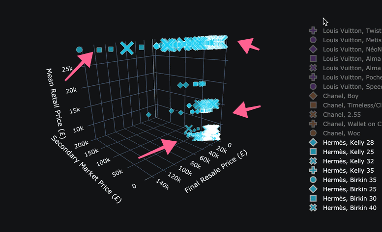
 

* Here are all Louis Vuitton observations / comparison of Mean Retail Price with Resale Price and Discounted Resale Price

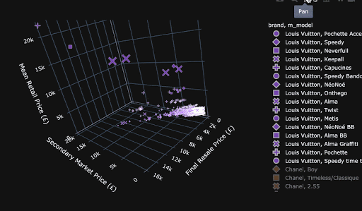
 

* Here are comparison of 3 prices across each data points of Chanel brand 

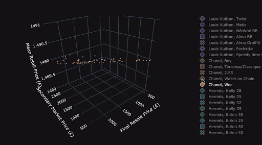
 

Next I performed a thorough EDA to get to know the data, the distributions of the features and the correlations between them.

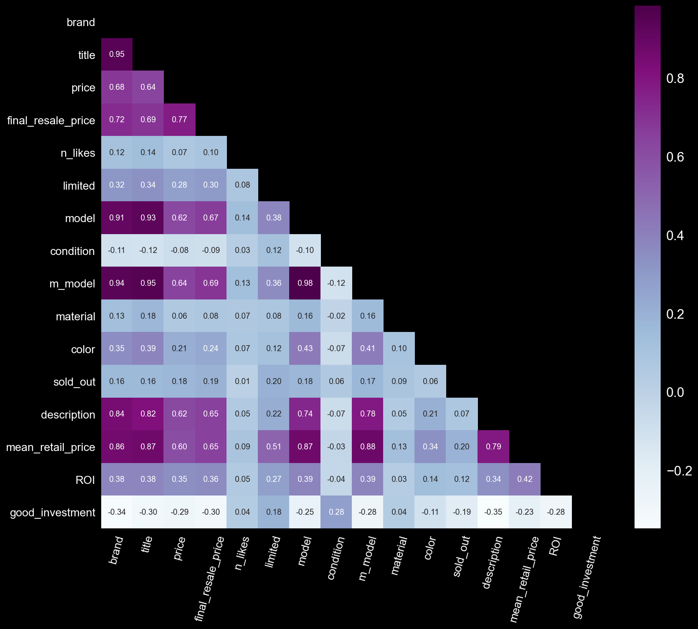

* Below we can review the interconnection between features in dataset:

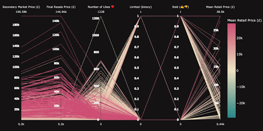

I have summarised the key findings and plots in the following notebook:
[EDA_Visuals](Part_3/EDA_Data_Visualizations.ipynb)

### The target

Regression models with the continuous numbers of resale value of designer handbags (‘final_resale_price’) as the first target.

To define the second target variable for classification model, final resale price has been transformed into binary class "worth to buy" or "not worth to buy" assigned as 1 or 0 respectively, based on Return on Investment (ROI) above or below 0 in percentage.

### Features

I derived 2 further features from the data to attempt to gain more information on investment returns.

* The ROI column is a derived variable, calculated by subtracting the initial value of the investment from the final value of the investment (which equals the net return), then dividing this new number (the net return) by the cost of the investment, and finally, multiplying it by 100, to get the percentage value.

* Binary classification target variable based on Return on Investment values (positive - 1, negative - 0).

## Modelling

### Preparing the data

* Feature selection

I selected features that contained information about the handbag and ensured that there was no leakage of information about its Resale Price, then dummidfied the categorical columns.

predictors_reg = ['brand', 'n_likes', 'limited', 'condition', 'm_model', 'material', 
              'color', 'sold_out', 'mean_retail_price']
              
cols_to_dummy = ['brand', 'condition', 'm_model', 'material', 'color']

target_reg = ['final_resale_price']

* Train-Test Split

I applied a 70:30 train-test split to the data.

* Standardisation

I applied the StandardScaler to the features as many of the models I will test require this.

class_predictictors = ['brand', 'n_likes', 'limited','condition', 'm_model', 'material', 'color', 'sold_out']

cols_to_dummy = ['brand', 'condition', 'm_model', 'material', 'color']

target_class = ['good_investment']

I performed the same Train-Test Split with stratifying the target and Standardisation for the classification modelling.

### Fitting and scoring models

I fitted a range of regression models on the training set and obtained R2 scores for the training and test set. I performed 5-fold cross validation and obtained the mean CV score of it to check the generalisability of the model, and also calculated RMSE of the predictions.

Regressor the best model scores:

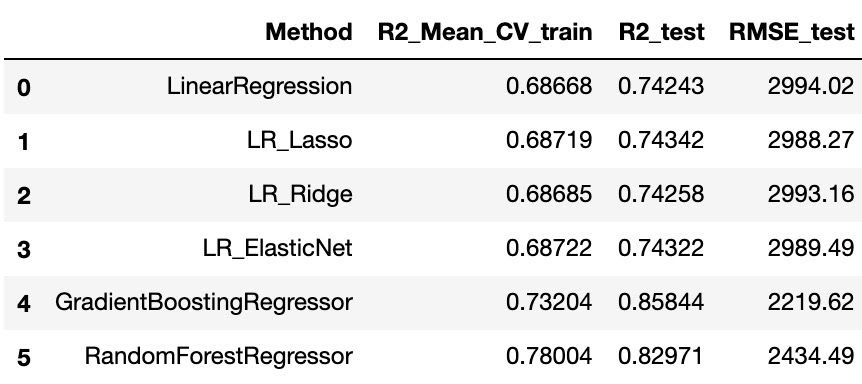

The simple Linear Regression model performs quite well with consistent train, test and mean CV scores.  Adding regularisation with the Ridge and Elastic Net models did not alter the results. The Gradient Boosting Regressor model showed significant improvement in R2 scores and errors.

The Classification models have much stronger scores at predicting a designer handbag to be whether good investment or opposite. Baseline predictions for classification models is 0.678, whereas most models have Mean CV  𝑅2  train and  𝑅2  test scores of 0.83-0.84. The best performance has Grid Search Gradient Boosting Classifier with an Mean CV  𝑅2  score of 0.8449 on train data and an  𝑅2  score of 0.8518 on unseen data, which is really great.

Classifier the best model scores:

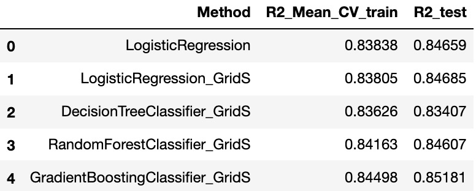

## Evaluation

* Best Regression Model

The residuals plot from YellowBrick shows the error against the predicted value for the training data and the testing data. It allows us to look for heteroskedasticity in the model; e.g. regions in the target where the error is greatest. The residuals appear to be relatively randomly distibuted, though the models appears to have a tendency to underestimate the highest values.

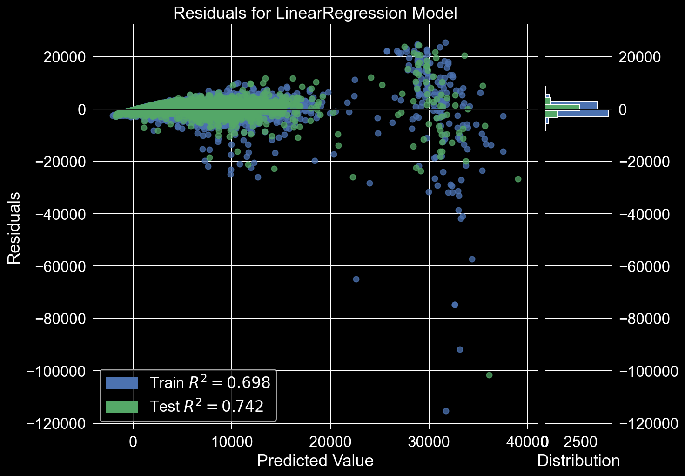

One of the most standing out coefficient rise in price up to £4,300, is the mean Retail price (official store price), it means that the higher the original handbag price the more it can elevate in value for resale on Secondary market platform. Chanel brand has lots of indicators showing that it losses the value up to ~ £400. Model 2.55 has the highest impact on the price across Chanel brand. Never worn condition continues to demonstrate its improvement as a positive indicator, whereas good, fair and vintage condition are dropping the resale price down to ~ £300. Strong positive coefficients have small Hermes handbags like Kelly 25, Birkin 25 and Birkin 30, nevertheless Kelly 28 and Birkin 35 also have worthwhile effect on resale price.

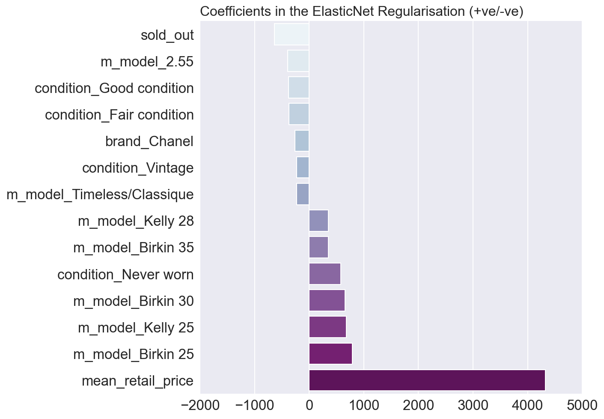

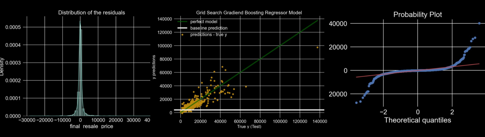

* Best Classifier Model

The condition of the handbags plays a big part at predicting the return on investment , Hermes brand seems to be the most important feature in all classification models to define the type of investment. Moreover, the handbag being limited edition takes high importance in all classifiers as well. All models are generalising predictions very well and quite equally. The best performance has Gradient Boosting Classifier model with Grid Search.

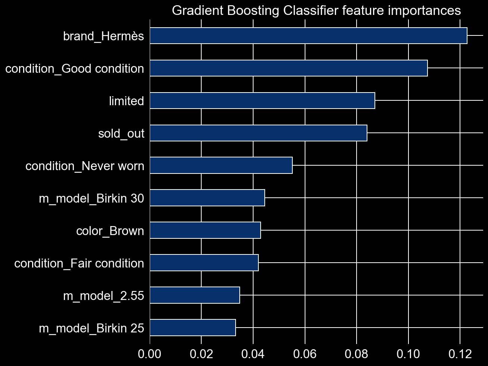

In terms of predicting whether the purchase is a good investment or not, it is better to have higher Precision score. In this case it will reduce the probability to make a wrong purchase and have more benefits for investors.

The trade off of having higher Precision score, means to reduce Recall score, therefore it will produce more False Negatives , which is better than derive more False Positives. It's more profitable choice for customers who wants to make returns on their investments, because assigning a handbag as a good investment while it's not, will have a big impact on ROI for the customers. 

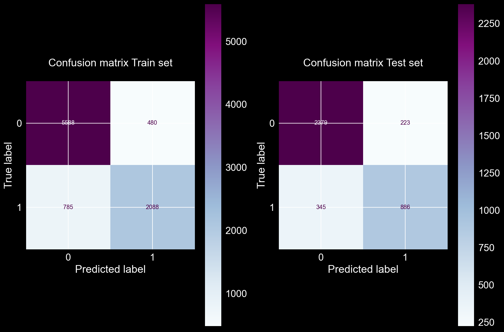

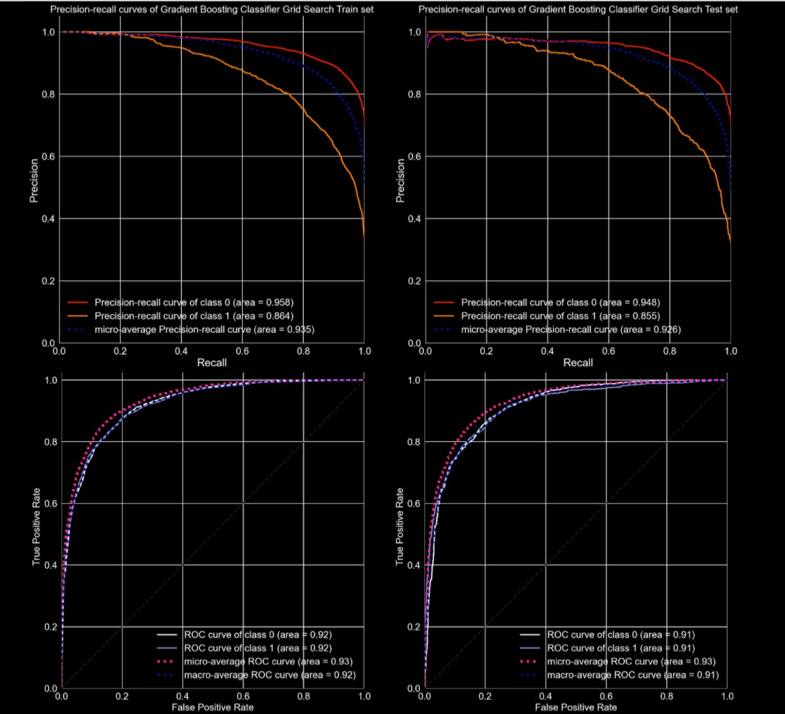

For more examples of the best models and evaluation can be found in the following notebook:
[Modelling_findings](Part_4/Predictive_Models_Findings_Technical_Report.ipynb)

#### Deep learning model using TensorFlow

Deep learning technique showed great results, right after 2 epochs, the accuracy score and cross validation scores were already above 0.8257 and 0.8217 respectively. It had 4 hidden layers, 'relu' / 'softmax' activation methods and Adam optimizer.

* Plot of improvement process of the scores 

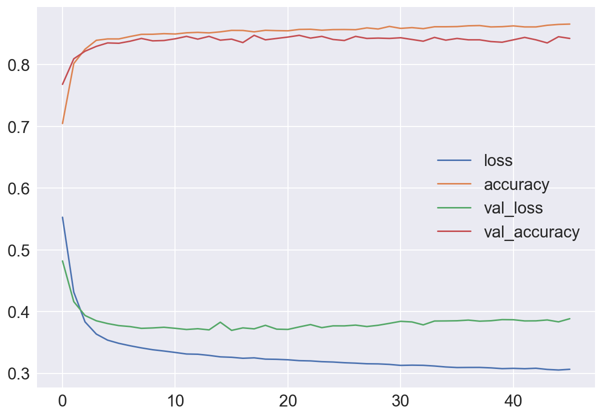

### Limitations

* Time information

One of the biggest limitations was the absence of the time when the handbag was made, it would be really cool to use time values to see the changes of pricing across all models over time. 

I would like to answer the questions, like:
* What is a good investment over time?
* How much time do you need for it to rise or drop in value?
* How long should I hold a bag before selling it?
* How does the iconic handbag value change over time? (predicting the value in the future)

Hermes and Chanel have such a strong influence in the fashion world that they have the ability to rapidly increase prices in a short period of time.

## Conclusions

Key points to make your purchase a good investment:

* Limited Editions

Limited edition bags are an interesting prospect as they provide an excellent opportunity for investment, but only if the right styles are chosen. 

* Patience is a Virtue

One of the most important things to remember when purchasing an investment piece is patience. Don’t buy a bag and expect an immediate return. It may take a few years for your investment to grow, so be prepared for that. However, this doesn’t mean you can’t use your bag as long as you maintain the condition.

* Maintain the Condition

When reselling an investment piece, the most important factor in determining the resale price is the condition of the product. If you keep your bag in pristine, excellent, or even very good condition you can expect an excellent return. However, if your bag is full of scratches or watermarks, you won’t get the most from your investment.

To get the most resale value for your investment bag, invest in the holy trinity:
* Hermès Birkin and Kelly handbags with exotic leathers
* Louis Vuitton handbags limited editions
* Chanel Woc / Classic flaps

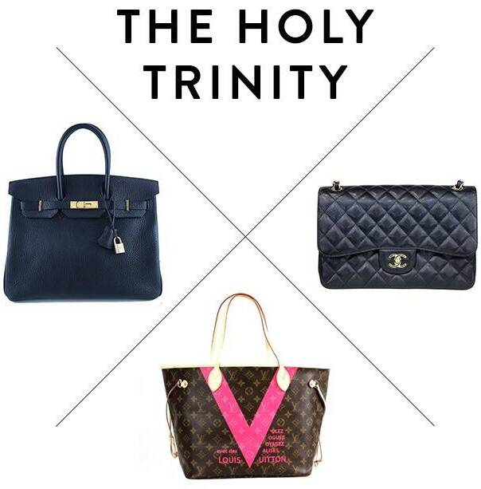

While the value of luxury handbags can fluctuate due to trends or buzz, these three iconic brands in certain styles have the most resale value.
The Birkin is expected to only increase in value going forward. Its high retail price, limited availability, and strong presence on the secondary market demonstrate that it is still a highly coveted piece. 
Kelly holds its value well in the secondary market just like the Birkin. Both bags are exclusive and difficult to procure due to its limited availability and high appeal. Anything that is hard to get is highly coveted.

* Recommended Price for your handbag for Resale

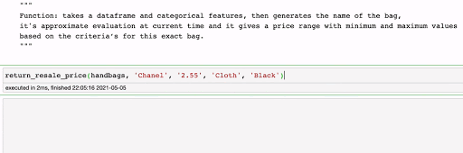

* Project Presentation - [link to presentation](https://docs.google.com/presentation/d/e/2PACX-1vQdfZQnS3l5SRDOtAVq1X5dTu2prK8tpXyrfGv_K-6ku75HGha7y-_RFJH0kjANc6_6hUQetg4o4pPQ/pub?start=true&loop=false&delayms=3000)

Overall this has been an interesting and worthwhile project. A full range of regression and classification modelling techniques were employed and the models scored highly on the selected feature of the dataset. The next steps for this project would be:
- Add more detailed features of the date the handbag was made.
- Collect data on retail price of the handbag of a certain year, retrain and evaluate the model.
- Use other techniques such as clustering and network analysis to identify handbag characteristics and features.

If you found this project interesting and would like to discuss further then please feel free to contact me via Github or [LinkedIn](https://www.linkedin.com/in/dr-ketevana-barabadze/).
